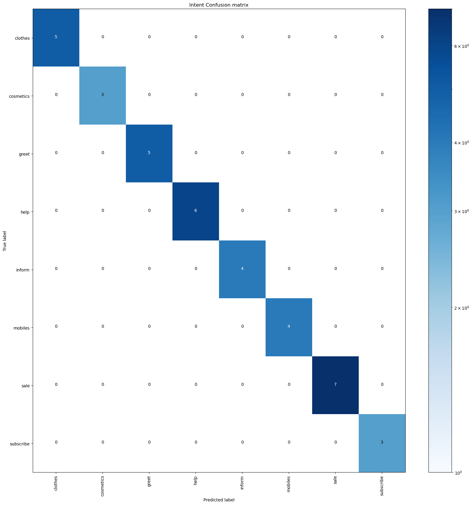

# Python Setup

```
sudo apt update
sudo apt -y upgrade
python3 -V
sudo apt install -y python3-pip
sudo apt install build-essential libssl-dev libffi-dev python3-dev
```

# Venv Steps

```
sudo apt install -y python3-venv
python3 -m venv my_env
source my_env/bin/activate

To QUIT -> quit()
```

# Installation

```
The requirements for running this part of the program are mentioned as follows and can be downloaded with pip.
```

```bash
pip install sqlite
pip install rasa
```

# Steps to run rasa:

```
It's a two step process and we need to run the action server as well as enable api.
Step 1 : Enabling the Rasa API for interacting with django
```

```bash
rasa run --enable-api
```

```
Step 2 : Starting the action server for using custom actions of rasa and connection with database
```

```bash
rasa run actions
```

# Queries for which rasa is trained

```
Rasa can handle questions for the following queries :
- Upcoming Sales
- Regarding support
- Last order
- Shipping Address
- Track your order
- All your previous orders
- All the categories
- Clothing products
- Gadgets products
- Pending orders in your cart
- Subscribe to Myntra Newsletter
- Money spent till now

Note : Currently our bot uses data from a SQLite Database containing demo data . On a production level , all the queries will have the access to myntras database and will answer
all the queries perfectly.

```

# Evaluation Metrics for Rasa :

Confusion Matrix



# API Request Samples

```

Endpoint -> http://localhost:5005/webhooks/rest/webhook
```

```bash
{
"message": "hello",
"sender": "user1"
}

```

# Learn More

You can learn more about rasa, it's installation steps, working and it's action server at [Rasa Documentation](https://rasa.com/docs/rasa/)
